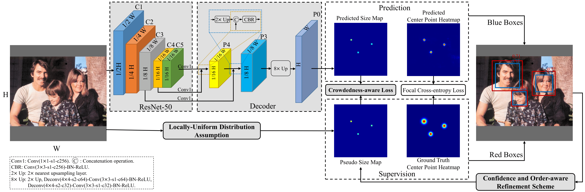
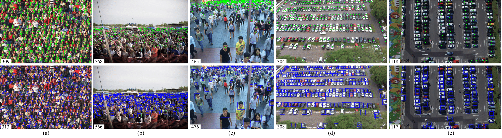
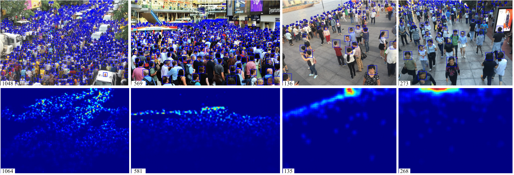

# Crowd-SDNet: Point-supervised crowd self-detection network
Keras implementation of of [paper](https://ieeexplore.ieee.org/abstract/document/9347744): **A Self-Training Approach for Point-Supervised Object Detection and Counting in Crowds**. The code is developed based on [CSP](https://github.com/liuwei16/CSP).
This work is accepted by IEEE TIP 2021.

## Progress
- [x] Training and Testing Code of WiderFace
- [ ] Training and Testing Code of ShanghaiTech


## Introduction
In this article, we propose a novel self-training approach named Crowd-SDNet that enables a typical object detector trained only with point-level annotations (i.e., objects are labeled with points) to estimate both the center points and sizes of crowded objects.
This is achieved by the proposed locally-uniform distribution assumption, the crowdedness-aware loss, the confidence and order-aware refinement scheme, and the effective decoding method, which promote the detector to generate accurate bounding boxes in a coarse-to-fine and end-to-end manner.


## Dependencies

* Python 2.7
* Tensorflow 1.14.1
* Keras 2.0.6

  The libraries are shown in ```./requirements.txt```.

# Getting Started
1. [Installation](#installation)
2. [Preparation](#preparation)
3. [Training](#training)
4. [Test](#test)
5. [Evaluation](#evaluation)
6. [Models](#models)

## Installation
1. Clone this repo in the directory.
```
git clone https://github.com/WangyiNTU/Point-supervised-crowd-detection.git
```
2. Install the requirments.
```
cd Point-supervised-crowd-detection
pip install -r requirements.txt
```

## Preparation
1. Dataset downloading.

   For the WiderFace dataset, we download the training and validation images and annotations at [WiderFace](http://shuoyang1213.me/WIDERFACE/) and put it in `./data/WIDER` with the folder tree:

```
-- WIDER
    |-- WIDER_train
        |-- images
            |-- 0--Parade
            |-- 1--Handshaking
            |-- ...
    |--WIDER_val
            |-- images
            |-- 0--Parade
            |-- 1--Handshaking
            |-- ...
    |--wider_face_split
         |-- wider_face_train_bbx_gt.txt
         |-- wider_face_val_bbx_gt.txt
         |-- ...
 ```

2. Dataset preparation.

   Prepare an annotation-cache file by the locally-uniform distribution assumption (LUDA) method, which generates the pseudo object sizes. (Change WIDER Face dataset folder and split (train or val) in the code)
   By default, we assume the cache files is stored in `./data/cache/`.
```
python LUDA_generate_wider.py
```

3. Initialized models preparation.

   We use the backbone [ResNet-50](https://github.com/fchollet/deep-learning-models/releases/download/v0.2/resnet50_weights_tf_dim_ordering_tf_kernels.h5) in our experiments. By default, we assume the weight files is stored in `./data/models/`.

## Training
1. Train on WiderFace.

   Follow the [./train_wider.py](./train_wider.py) to start training. The weight files of all epochs will be saved in `./output/valmodels/wider`.

   Optionally, you should set the training parameters in [./keras_csp/config.py](./keras_csp/config.py) or replace some parameters in train_wider.py.

## Test
1. Test on WiderFace.

   Follow the [./test_wider.py](./test_wider.py) to get the detection results. The results will be saved in `./output/valresults/wider`. 
   Without [Training](#training), the test code can be performed with pretrained model from [Models](#models).

   We adopt the similar multi-scale testing as [CSP](https://github.com/liuwei16/CSP) and [Point in, Box Out](https://openaccess.thecvf.com/content_CVPR_2019/html/Liu_Point_in_Box_Out_Beyond_Counting_Persons_in_Crowds_CVPR_2019_paper.html). 
 Since using multi-scale testing and there is no optimization of soft nms (cpu python version), it will take several hours to run the val set.
 Some scales like [0.75, 1.25, 1.75] can be removed to increase inference speed with a little performance decrease.

## Evaluation
1. Calculate AP scores. 
   
   Download [Evaluation tool](http://shuoyang1213.me/WIDERFACE/support/eval_script/eval_tools.zip) for the official website of WiderFace.

   Follow the wider_eval.m to obtain AP scores and charts on the easy, medium, and hard subsets. (Specify your prediction directory: pred_dir)


2. Counting by detection.
   
   Get the MAE, MSE, NAE on the WiderFace val set by running
   ```
   python tools/counting_by_detection.py
   ```
   Specify 'part' to the dataset name (wider) and 'split' to val.


3. Plot predicted detections of WiderFace.
   
   Plot detections on the image files by running
    ```
   python tools/plot_wider_detections.py
   ```
   
   Qualitative results on (a) WiderFace, (b) SHA, (c) SHB, (d) PUCPR+, and (e) CARPK. The top row shows the ground-truth boxes or points, and counts. The bottom row shows the bounding boxes and counts predicted by our approach.
   

   Comparisons between the bounding boxes (at top row) produced by our approach and the density maps (at bottom row) produced by [CSRNet](https://openaccess.thecvf.com/content_cvpr_2018/papers/Li_CSRNet_Dilated_Convolutional_CVPR_2018_paper.pdf).
   
   
## Models
To reproduce the results in our paper, we have provided the models. You can download them through [Onedrive](https://entuedu-my.sharepoint.com/:f:/g/personal/wang1241_e_ntu_edu_sg/Eho-8oGGWrZMtoW_xL_Kk8kBQdnxkrXmhbU_2M_Qj_nD1A?e=5qqhNh).

1. For WiderFace
 
   Download it from [output/valmodels/wider/h/off/](https://entuedu-my.sharepoint.com/:u:/g/personal/wang1241_e_ntu_edu_sg/Ead4QUxwq1dPgOsQlJK3avwBE2QocMtFEk_UWyi-cJQfEA?e=pwzRRg) and put it in the `./output/valmodels/wider/h/off/`


# Citation
If you find this project is useful for your research, please cite:
```
@article{wang2021self_training,
  title={A Self-Training Approach for Point-Supervised Object Detection and Counting in Crowds},
  author={Wang, Yi and Hou, Junhui and Hou, Xinyu and Chau, Lap-Pui},
  journal={IEEE Transactions on Image Processing},
  volume={30},
  pages={2876--2887},
  year={2021},
  publisher={IEEE}
}
```
